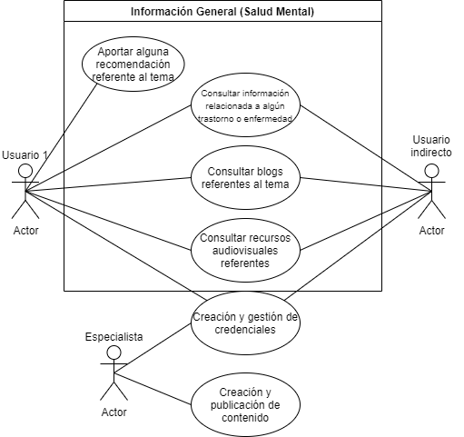
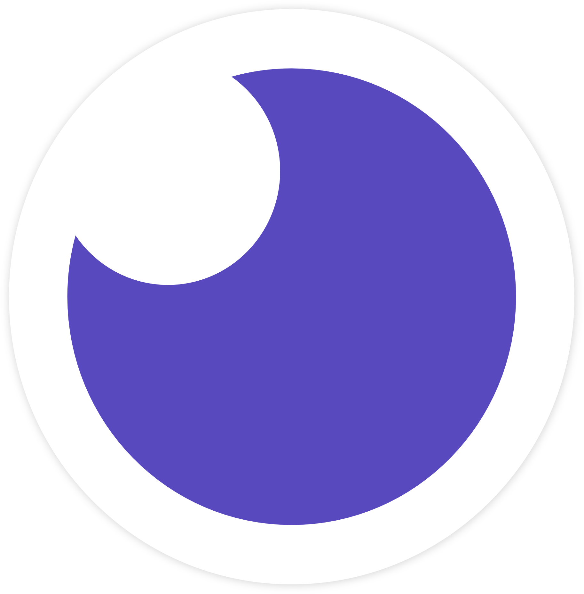

<!-- Título del proyecto -->

# <b>Peace of Mind</b>

<!-- Presentación del equipo -->

## Equipo 2 (Los Semidioses)

### <b>Integrantes:</b>

- André Chapina

- Noé Rodríguez

- Víctor Anizar

- Mark Anthony López

<!-- Descripción del proyecto -->

## <b>Descripción del proyecto</b>

<i>Peace of Mind</i> Es una plataforma enfocada a proveer recursos digitales sobre salud mental, dirigida a personas que sufren algún tipo de trastorno o enfermedad mental, a personas que estén interesadas en saber más acerca del tema (estudiantes, familiares, amigos o conocidos del paciente) y a especialistas que pueden brindar contenido de apoyo en forma de recursos digitales (escribir blogs, recursos audiovisuales y recomendaciones que pueden ser de utilidad para cualquier usuario).

<!-- Entidades y funcionalidades -->

## <b>Entidades</b>

1. <b>Usuario</b>

- _Usuario directo (paciente)_
  - Consultar información relaciona con algún trastorno o enfermedad.
  - Consultar blogs y recursos audiovisuales referentes.
  - Aportar alguna recomendación personal como recurso de utilidad para otros usuarios.
  - Creación y manejo de sus credenciales.
- _Usuario indirecto (estudiante, familiar, amigo o conocido del paciente)_
  - Consultar información relaciona con algún trastorno o enfermedad.
  - Consultar blogs y recursos audiovisuales referentes.
  - Contactar a un especialista.
  - Creación y manejo de sus credenciales.
- _Usuario externo (especialista)_
  - Creación y publicación de contenido referente a algun trastorno o tratamiento especializado.
  - Creación y manejo de sus credenciales

2. <b>Artículos</b>

- Serán relacionados a algún trastorno o tratamiento de alguno.
- Serán proporcionados por instituciones dedicadas a la salud mental o por especialistas.

3. <b>Recursos</b>

- Pueden ser videos, playlist, películas, documentales, libros, técnicas relacionadas con el tratamiento.

4. <b>Comentario</b>

- Serán proporcionados por la misma comunidad (cualquier tipo de usuario), pueden contener recursos y/o artículos.

5. <b>Trastorno o Enfermedad</b>

- Son trastornos o enfermedades que afectan la salud mental y será utilizada como entidad para filtrar la información, los artículos y los recursos.

<!-- Historias de Usuario -->

## <b>Historias de usuario</b>

<u>Historia 1</u>

Eres un individuo que considera que necesita ayuda con salud mental. (No diagnosticado con un trastorno o enfermedad) Ejemplo: Estás atravesando una crisis de ansiedad.

<u>Historia 2</u>

Eres un individuo no profesional pero interesado en ayudar a alguien.

<u>Historia 3</u>

Eres un profesional que puede ser de ayuda para un individuo.

<u>Historia 4</u>

Eres una persona que quiere buscar ayuda para un amigo, conocido, familiar diagnosticado o no diagnosticado. Ejemplo: Mi hermano tiene autismo.

<u>Historia 5</u>

Eres un individuo que considera que necesita ayuda con su salud mental. (Diagnosticado con un trastorno o enfermedad) Ejemplo: Padeces de esquizofrenia y quieres tratarte.

<!-- Breve descripción técnica del proyecto c/logos -->

## <b>Tecnologías utilizadas</b>

Para la realización de este proyecto se utilizaron distintas tecnologías para poder realizar distinas tareas, tales como:

- Mongo DB (Base de datos)
- Insomnia (Para correrlo)

- Postman (Para correrlo)

- GitHub (Repo del proyecto y documentación)

- Visual Studio Code (Editor de texto)

- Git (Trabajo con ramas, versiones, clonar, hacer push, etc.)
